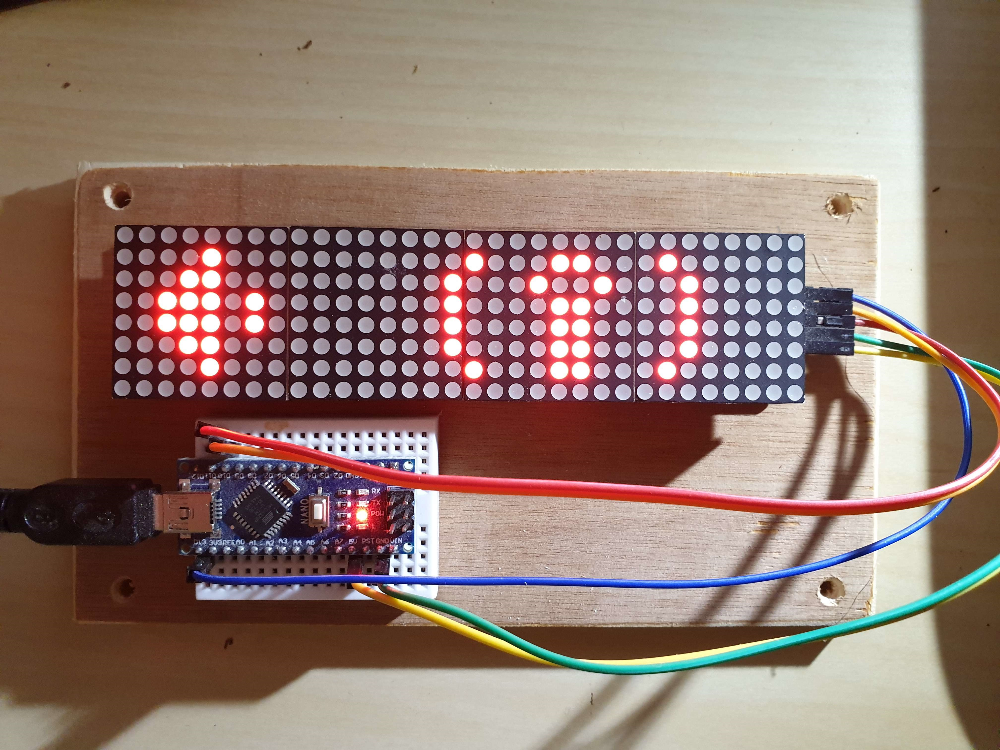

# OnAirSign
"On-Air" led sign - controller application

**update [30-Jan-2021]: Finally - the beta version is completed and ready for everyone to use.**

Working from home is not simple, we all have distractions and interruptions. 
But from now on, you can at least make sure everybody knows that you are in a call and should not be interrupted. 

## How can you do it ? 

Using a few affordable components you can now build your own "On-Air" sign, which monitors your computer audio devices. 
The sign is a 8x32 dot matrix which tells everyone around if you are currently listening to something, someone is listening to you, or both.
Once the software is running - everything is automatic, the "On-Air" sign will update automatically to reflect the current status of your microphone and speakers. 

Here is a picture of the prototype, don't worry - your one is going to be much nicer

## What do I need to start ? 
Not much, some basic electricity and computer programming skill level is required, as you need to load the software and connect some wires yourself. 
You also need to buy the components to set it up. 

## Where do I start ? 
I'm just working on a wiki page: [Setting up On Air Sign - the complete guide](https://github.com/weiss-gal/OnAirSign/wiki/Setting-up-On-Air-Sign---the-complete-guide)

## What's up next
I have many ideas in mind, and you are welcome to bring your own, here are a few of mine:
* Adding support for camera status (very usefull if you happen to work from your bedroom)
* Bluetooth connectivity - so you can put the sign away from your computer 

if you have questions or anything to contribute, contact me: weiss_gal at yahoo.com

The arduino part of this project (should work for any arduino device) can be found here: https://github.com/weiss-gal/OnAirSign-Arduino
